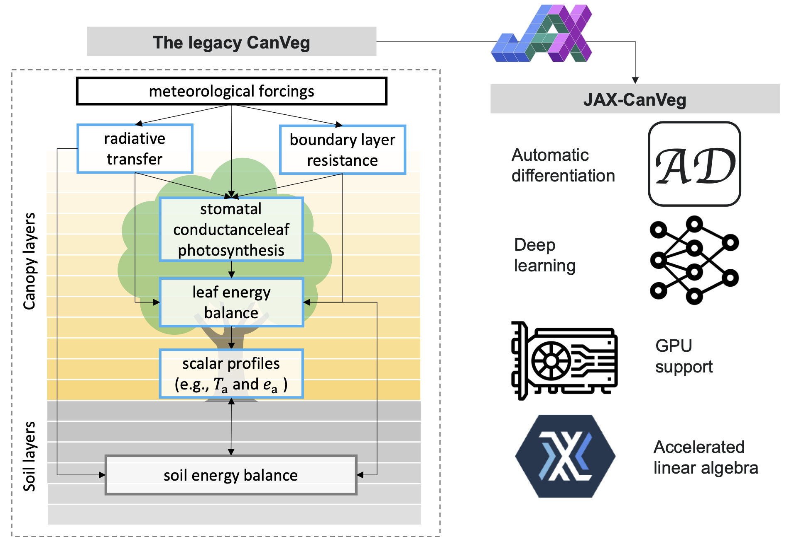
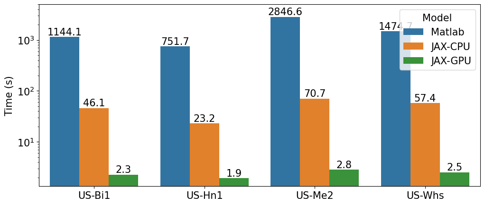
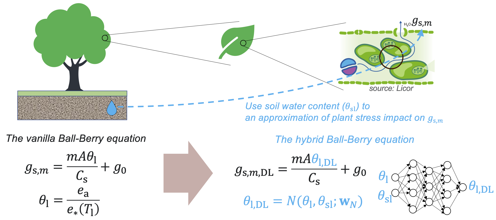
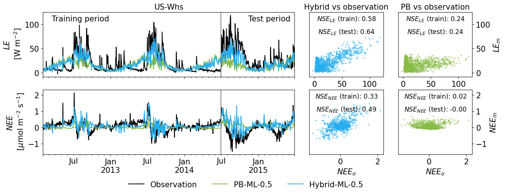

# JAX-CanVeg: A Differentiable Land Surface Model

<p align="center">

</p>

## Table of Contents
- [Overview](#overview)
- [Repo structure](#repo-structure)
- [Installation](#installation)
- [Getting Started](#getting-started)
- [Computational Time Benchmark](#computational-time-benchmark)
- [Example: A Hybrid Ball Berry Model](#example-a-hybrid-ball-berry-equation)
- [License](#license)
- [Acknowledgments](#acknowledgements)
- [Citation](#citation)
- [Contacts](#contacts)

## Overview
Land surface process describes the water, energy, and carbon cycles exchanged among the atmosphere, canopy, and soil. Its complex interacting nature makes it challenging to model due to the associated unknown biophysical and ecophysiological parameters and less-mechanistically represented subprocesses. Differentiable modeling provides a new opportunity to explore the parameter space and capture these complex interactions by seamlessly coupling process-based and deep learning models. Here, we developed a differentiable land surface model by reimplementing an existing simulator, [CanVeg](https://github.com/baldocchi/CanVeg), in [JAX](https://github.com/jax-ml/jax) -- a Google-developed Python package for high-performance machine learning research using automatic differentiation. Anchored in differentiable modeling, we expect that JAX-CanVeg provides a new avenue for modeling land-atmospheric interactions by leveraging the benefits of both data-driven learning and process-based modeling.

## Repo Structure
```
.
+-- src/jax_canveg
+-- examples
+-- data
+-- environment.yml
+-- doc
+-- README.md
```
- `src/jax_canveg`: providing source codes for JAX-CanVeg.
- `examples`: providing example notebooks for running JAX-CanVeg at four selected flux tower sites.
- `data`: providing the observation data (including both flux tower and MODIS) and the simulated lagrangian particles.
- `environment.yml`: the YAML file for creating the conda virtual environment.
- `doc`: providing a list of documentation files and figures.
- `README.md`: the readme file.

## Installation
Please follow the procedures of this [post](./doc/INSTALLATION.md) to install JAX-CanVeg.


## Getting Started
We suggest training and running JAX-CanVeg by providing a JSON-based configuration file. See this [post](./doc/MODEL_CONFIG.md) for details.


## Computational Time Benchmark
<p align="center">

</p>

We compared the computational time of JAX-CanVeg with the legacy Matlab-based [CanVeg](https://github.com/baldocchi/CanVeg). The benchmark was performed on one A100 GPU and  one AMD EPYC 7763 CPU at four flux tower sites. See this [post](./doc/COMPUTE_TIME_BENCHMARK.md) for benchmark details. 


## Example: A Hybrid Ball-Berry Model
<p align="center">

</p>

We demonstrated JAX-CanVeg's hybrid modeling capability by applying the model to simulate the water and carbon fluxes at four flux tower sites in the western United States with varying aridity. To this end, we developed a hybrid version of the Ball-Berry equation that emulates the impact of water stress on stomatal closure (Jiang et al., 2024). The scripts for reproducing the results of the paper are available in the folder `examples`. We applied the differentiable JAX-CanVeg at four flux tower sites to evaluate the performance of a hybrid version of the Ball-Berry equation. The model were trained against both observed latent heat fluxes and net ecosystem exchange. Below we illustrate the application example on [US-Whs](./examples/US-Whs) (which is applicable to the other three flux tower sites, i.e., [US-Me2](./examples/US-Me2), [US-Bi1](./examples/US-Bi1), and [US-Hn1](./examples/US-Hn1)).


- **Step 1:** Train the process-based and hybrid JAX-CanVeg and the pure neural networks:
```sh
python [jax-canveg-folder]/examples/US-Whs/train_models.py
python [jax-canveg-folder]/examples/US-Whs/train_dnns.py
```

> [!NOTE]
> Training multiple JAX-CanVeg models will take a pretty long time. It is suggested to train it in an HPC system. We provide an example of sbatch job script [here](./examples/nersc_job.sh).

- **Step 2:** Evaluate the simulation performance of the trained models including both JAX-CanVeg and DNNs:
```sh
cd [jax-canveg-folder]/examples/US-Whs
python postprocessing.py
```

- **Step 3:** Calculate the parameter sensitivity of selected models:
```sh
cd [jax-canveg-folder]/examples/US-Whs
python calculate_sensitivity.py
```

> [!NOTE]
> This step requires the completion of model training at all four sites. One can modify the code to calculate the sensitivity at specified sites.

- **Step 4:** Visualize the training results using [TrainingAnalysis.ipynb](./examples/TrainingAnalysis.ipynb)

- **Step 5:** Visualize the sensitivity analysis results using [SensitivityAnalysis.ipynb](./examples/SensitivityAnalysis.ipynb)

Some simulations of the trained JAX-CanVeg --
<p align="center">

</p>


## License
Distributed under Simplified BSD License. [LICENSE](./LICENSE) for more information.

## Acknowledgements
This work was funded by the Laboratory Directed Research and Development Program at Pacific Northwest National Laboratory and the ExaSheds project supported by the United States Department of Energy, Office of Science, Office of Biological and Environmental Research, Earth and Environmental Systems Sciences Division, Data Management Program.

## Citation
Jiang et al., (2024). JAX-CanVeg: A Differentiable Land Surface Model. Water Resources Research, *in review*.

## Contacts
Peishi Jiang (peishi.jiang@pnnl.gov)